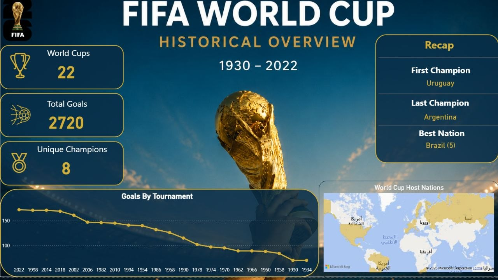

# World Cup Historical Overview

An interactive Power BI dashboard providing a historical overview of the FIFA World Cup, exploring tournament history, match results, goals, team performance, and key statistics across different editions.

## Project Overview

This project transforms historical FIFA World Cup data into an interactive dashboard that allows users to explore tournament history and compare team and tournament performance over time.

The dashboard was developed as a Data Analysis and Business Intelligence project using Power BI.

## Objective

The goal of this project was to transform historical World Cup data into an interactive and easy-to-explore dashboard, allowing users to discover patterns and compare tournament and team performance across different editions.

## Analysis Areas

* World Cup history
* Tournament results
* Goals and scoring trends
* Team performance
* Match statistics
* Historical comparisons
* Tournament-level KPIs

## Tools & Technologies

* Power BI
* Power Query
* DAX
* Data Modeling
* Data Visualization

## Analysis Process

### 1. Data Preparation

Prepared and structured the historical World Cup dataset for analysis in Power BI.

### 2. Data Modeling

Built the data model required to analyze tournament, match, goal, and team-level information.

### 3. Data Analysis

Created analytical measures and explored tournament, match, goal, and team-level statistics.

### 4. Dashboard Development

Developed interactive KPI cards and visualizations to make the historical data easy to explore and compare.

### 5. Insights

Analyzed the dashboard to identify patterns and compare performance across different World Cup editions.

## Dashboard Preview

### Main Dashboard

## Key Insights

Key insights from the dashboard will be documented here based on the final analysis.

## Project Files

* `dashboard/` — Dashboard screenshots
* `README.md` — Project documentation

## About the Project

This project is part of my growing Data Analysis and Business Intelligence portfolio, where I practice transforming datasets into meaningful analysis and interactive dashboards.

## Author

**M. Zain Kabbany**

Junior Data Analyst

Focused on SQL, Power BI, Python, and Data Analysis.
